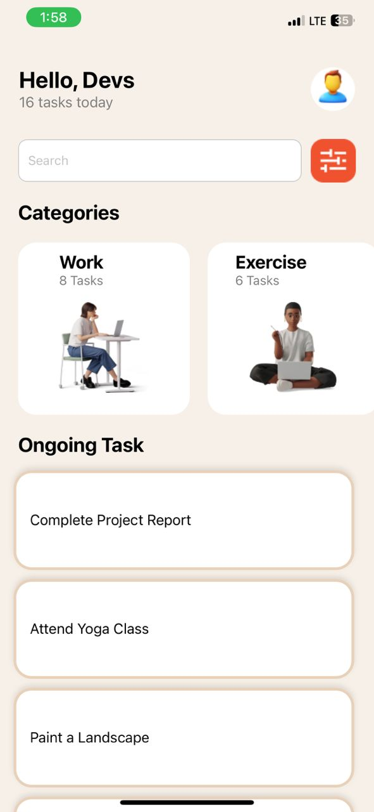
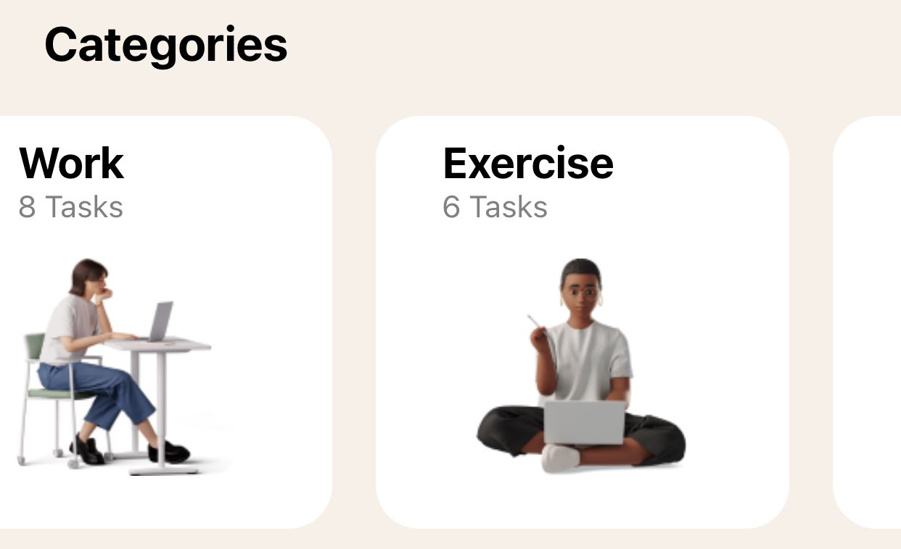
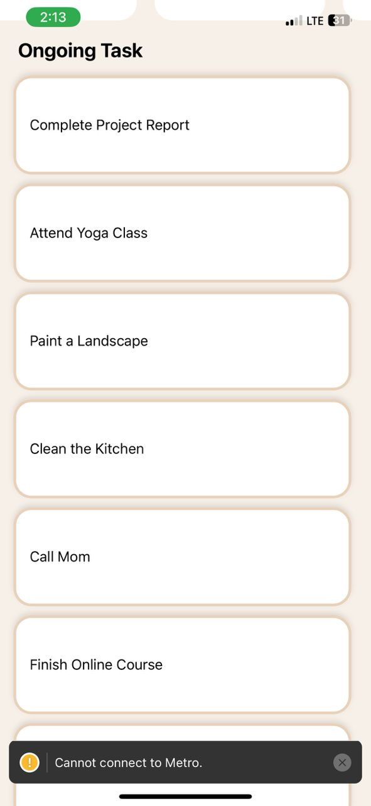

# rn-assignment3-11253177

This Task Manager App is a simple React Native application that helps users manage and track their daily tasks. The app consists of a header displaying the user's name and the number of tasks, a search bar, a horizontal list of categories, and a vertical list of ongoing tasks.

### Components

#### 1. CategoryCard

**Description:**

`CategoryCard` is a component that displays a category of tasks. It includes the category name, the number of tasks in that category, and an image representing the category.

**Props:**

- `category` (String): The name of the category.
- `tasksCount` (Number): The number of tasks in the category.
- `imageUri` (Number): The ID used to select the appropriate image for the category.

#### 2. Header

**Description:**

`Header` is a component that displays a greeting message with the user's name and the number of tasks for the day. It also includes a user icon.

**Props:**

- `username` (String): The name of the user.
- `tasksCount` (Number): The number of tasks for the day.

#### 3. TaskItem

**Description:**

`TaskItem` is a component that displays a single task in a stylized container.

**Props:**

- `task` (String): The description of the task.

### Main App Component

The main `App` component integrates these components into a cohesive user interface. It includes:

- **Header**: Displays a greeting with the user's name and the number of tasks.
- **Search Bar**: Allows users to search for specific tasks.
- **Categories**: A horizontal list of categories displayed using `CategoryCard`.
- **Ongoing Tasks**: A vertical list of ongoing tasks displayed using `TaskItem`.

This setup helps users to easily navigate and manage their tasks, keeping track of what needs to be done in an organized manner.

### Screenshots

#### 1. Home Screen

#### 2. Categories

#### 3. Task List

### How to Use

1. **Header**: Shows the greeting message and the total number of tasks for the day.
2. **Search Bar**: Allows the user to search for tasks.
3. **CategoryCard**: Displays different categories of tasks horizontally.
4. **TaskItem**: Lists the ongoing tasks vertically.

### Getting Started

1. Clone the repository.
2. Install the dependencies using `npm install`.
3. Run the application using `npm start`.

5. Open a pull request.